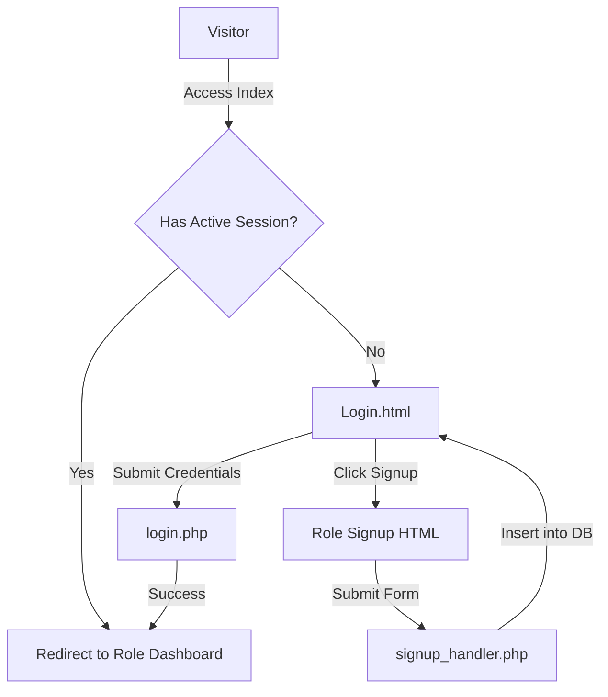
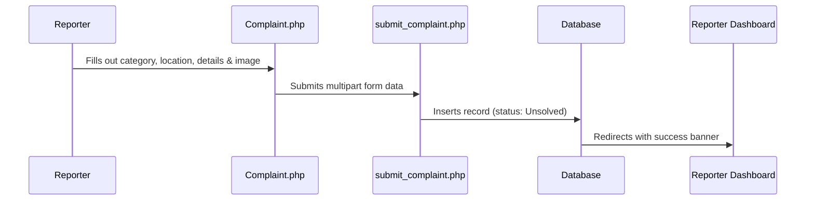

# 🛠️ Integrated Complaint Management and Centralization System (ICMCS)

The **Integrated Complaint Management and Centralization System (ICMCS)** is a web-based platform designed to automate and streamline the process of reporting, tracking, and resolving ICT-related issues within an institution.

It supports four distinct user roles—**Students**, **Lecturers**, **Technicians**, and **Administrators**—offering a specialized experience and workflow for each role.

---

## 📂 File Structure & Architecture

The project is structured as a modular monolithic PHP application. Below is the file structure and the role of each component:

```text
icmcs/
├── .devcontainer/
│   └── devcontainer.json    # GitHub Codespaces config (PHP, Apache, MySQL)
├── css/
│   ├── complaint.css        # Styles for the complaint submission page
│   ├── dashboard.css        # Styles for student, lecturer, tech, and admin dashboards
│   ├── header.css           # Styles for the persistent navigation bar
│   └── signup.css           # Styles for the registration forms
├── css-pro/
│   └── login.css            # Styles for the centralized login interface
├── images/                  # Graphical assets (logos and dashboard indicators)
├── README.md                # System documentation
├── .gitignore               # Excludes system junk files from git
│
│   /* DATABASE & SYSTEM CORE */
├── db_connect.php           # Auto-connecting database layer & table initializer
├── header.php               # Shared navigation layout with session management
├── index.php                # Entrypoint router (redirects based on active session)
├── logout.php               # Destroys active user sessions
│
│   /* AUTHENTICATION PATH */
├── Login.html               # Main login page
├── login.php                # Validates credentials and routes roles
├── admin_signup.html        # Signup form for Admins
├── lecturer_signup.html     # Signup form for Lecturers
├── student_signup.html      # Signup form for Students
├── technician_signup.html   # Signup form for Technicians
├── signup_handler.php       # Processes all registrations and hashes passwords
│
│   /* COMPLAINT SYSTEM */
├── Complaint.php            # Form for submitting new tickets
├── submit_complaint.php     # Uploads images and stores complaints in DB
├── Contact.php              # Static support contact information page
├── update_status.php        # Allows technicians/admins to change complaint status
│
│   /* ROLE DASHBOARDS */
├── student_dashboard.php    # Student ticket tracking dashboard
├── lecturer_dashboard.php   # Lecturer ticket tracking dashboard
├── technician_dashboard.php # Complaint list management for technicians
└── admin_dashboard.php      # Administrative control panel (statistics & reports)
```

---

## ⚙️ Core System Design & Workflow



### 1. The Auto-Setup Database Pattern (`db_connect.php`)
To eliminate manual setup, the database layer checks a sequence of standard local environments (MAMP, XAMPP, and Codespaces) using TCP ports and socket configs. 
Upon successful connection:
- It creates the `complaint_management` database if it does not exist.
- It dynamically initializes the `users` and `complaints` tables.
- It seeds a default administrator account (`admin` / `admin123`) if the database is empty.

### 2. Flexible Schema Design (`users` Table)
Different roles require different registration details (e.g., Students need Course/Year; Lecturers need Department; Admins need Privileges). To avoid an over-engineered schema or sparse tables, ICMCS utilizes a **JSON-based additional info column**:

*   **`users` Schema:**
    *   `user_id` (VARCHAR - Primary Key)
    *   `password` (VARCHAR - BCRYPT Hashed)
    *   `role` (VARCHAR - student/lecturer/technician/admin)
    *   `additional_info` (TEXT - stores role-specific metadata like department, course, or privileges as JSON)

### 3. File Upload & Complaint Lifecycle (`submit_complaint.php`)
When a user submits a complaint, the backend:
1. Validates the submission parameters (category, location, description).
2. Sanitizes input to protect against SQL Injection.
3. Uploads image attachments to the `uploads/` directory with unique names to prevent overwrites.
4. Inserts the record into the database with a default status of `Unsolved`.

---

## 👥 Role-Based Workflows

### 👨‍🎓 Students & 👩‍🏫 Lecturers (The Reporters)
*   **Action:** Can submit complaints and track their personal ticket histories.
*   **Workflow:**


### 🔧 Technicians (The Solvers)
*   **Action:** Can view all submitted complaints in the system.
*   **Workflow:**
    *   Technicians monitor the global board on `technician_dashboard.php`.
    *   They update statuses using inline dropdown select selectors. Changing a status instantly updates the database via `update_status.php`.

### 👑 Administrators (The Managers)
*   **Action:** Full system monitoring, user monitoring, and reporting.
*   **Features:**
    *   **Traffic Panel:** Displays counts of registered users grouped by roles.
    *   **Interactive Metrics:** Displays total solved, in-progress, and unsolved complaints.
    *   **Report Generator:** A print function configured via CSS print stylesheets to generate instant clean PDF paper records of active/past complaints.

---

## 🔒 Security Implementations

1.  **Password Encryption:** All passwords are encrypted on registration using BCRYPT (`PASSWORD_BCRYPT`), protecting user credentials in the database.
2.  **SQL Injection Mitigation:** Inputs are escaped using `mysqli_real_escape_string` or executed using prepared statements (`$conn->prepare`).
3.  **Session Guard Checks:** Dashboard scripts start with session role validation. If a user tries to access a dashboard that does not match their session role, they are redirected back to `Login.html`.
